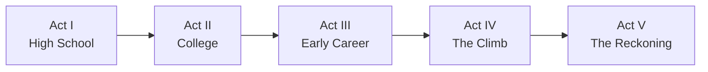

# 🪜 Climb the Ladder — Game Design Spec

> A darkly comedic 2D pixel-art life-sim about grinding yourself into a husk for a corner office you'll eat sad desk salads in.

---

## 1. Elevator Pitch

You play as **Alex Park**, a chronically overachieving high schooler who white-knuckles their way into an elite university, gets randomly funneled into whatever career track the universe decides, climbs to the top through sheer delusion and spreadsheet mastery, and eventually becomes a C-suite executive — only to realize that the friends and family they ghosted along the way were the entire point. It's like if *Succession* was a SNES game and the laugh track was you, nervous, alone.

**Genre:** 2D pixel-art narrative life-sim / RPG
**Tone:** Absurdly comedic → uncomfortably real → existentially dark → quietly hopeful
**Vibe:** *The Office* meets *Bojack Horseman* meets *Undertale* — you're laughing until you're not.
**Inspirations:**

| Game | What we borrow |
|---|---|
| *Undertale* | Meaningful choices with consequences; multiple endings; moral weight of decisions |
| *Stardew Valley* | Relationship meters; daily time management; seasonal progression |
| *Papers, Please* | Escalating work pressure; moral compromise as a game mechanic |
| *Cart Life* | Empathetic simulation of the grind; burnout as a system |
| *Game Dev Tycoon* | Career progression with branching strategy; resource management |
| *Celeste* | Metaphorical difficulty reflecting internal struggle |

---

## 2. Core Themes

1. **The Hedonic Treadmill** — each promotion feels good for exactly 4 seconds, then your Slack pings
2. **Opportunity Cost** — every hour spent grinding is an hour not spent with people who actually like you (a shrinking list)
3. **Identity vs. Title** — you put "VP of Strategy" in your Hinge bio. Your sibling put "makes great pasta." Guess who's happier.
4. **The Realization** — the emotional climax is not a victory. It's sitting in a $4,000/month apartment eating cereal at 11pm, looking at a group photo from 2009, and going "oh."
5. **The Cosmic Joke** — you don't even get to pick your career. The universe assigns it. Just like real life, but funnier.

---

## 3. Game Structure — Five Acts

The game is divided into **five acts**, each representing a life stage. Each act has its own gameplay loop, visual palette, and musical feel.



### Act I — High School (Tutorial)

**Setting:** Suburban town, pixel-art school, bedroom, local hangout spots
**Duration:** ~20 min
**Visual Palette:** Warm, golden — nostalgia-tinted

**Gameplay Loop:**

- Top-down exploration of your school and neighborhood
- **Study mini-games** (timed puzzles, memory matching) to raise your GPA stat
- **Extracurricular choices** — pick 2 of: debate club, student council, volunteering, coding club, sports
- **Relationship building** — spend time with 3-4 friends and your family (Mom, Dad, Sibling)
- Each day you allocate time slots (morning, afternoon, evening) — classic life-sim time management

**Key Mechanic — The Trade-Off Wheel:**
> A visual time-allocation UI. You have 3 time slots per day. Every slot spent studying is a slot NOT spent with friends/family. The game makes this tension feel visceral early on.

**Act I Climax:** College acceptance letter arrives. Your choices determine which tier of school you get into:

- **Tier 1** (Harvard/Stanford/Waterloo) — requires high study + strong extracurriculars, but you'll have fewer friendship points
- **Tier 2** (solid state school) — balanced path
- **Tier 3** (safety school) — you prioritized relationships

> [!IMPORTANT]
> All paths are valid and lead to the full game. Tier affects early-career difficulty and dialogue, but NOT the ending. The game subtly teaches that the "best" school doesn't guarantee the "best" life.

---

### Act II — College

**Setting:** University campus — dorms, lecture halls, frat row, library, career center
**Duration:** ~30 min
**Visual Palette:** Bright, competitive — blues and crimsons

**Gameplay Loop:**

- Expanded time management: 4 slots per day (morning, afternoon, evening, night)
- **Course selection** — pick a major (it won't matter as much as you think):
  - Economics / Finance — you tell everyone it's "versatile"
  - Computer Science — you tell everyone it's "the future"
  - Business — you tell everyone it's "practical"
  - Philosophy — you tell everyone... actually nobody asks
- **Networking mini-game** — attend career fairs and networking events (dialogue-tree based, *Undertale*-style)
  - Choose dialogue options that either feel authentic or performative
  - Performative answers build your "Network" stat faster, but drain your "Authenticity" stat
- **New relationships** — college friends, a potential romantic interest, a mentor professor
- **Old relationships decay** — your high school friends text you, but responding costs a time slot
- **Internship season** — a *Papers, Please*-style mini-game where you process applications, cover letters, and prep for interviews under time pressure

**Key Mechanic — The Résumé:**
> A persistent in-game document that accumulates your choices. NPCs react to it. It becomes a mirror of your priorities. Also it uses the wrong font and you'll never fix it.

**Act II Climax:** Graduation. You throw your cap in the air. The camera freezes. A slot machine UI appears and **randomly assigns your career track**. You have no say. The game displays: *"Congratulations! The economy has decided for you."*

---

### Act III — Early Career (The Grind Begins)

**Setting:** Big city — tiny apartment with one lamp, gleaming office tower, sad Sweetgreen, subway at midnight
**Duration:** ~40 min
**Visual Palette:** Desaturated, grey-blue — fluorescent lighting energy

**Career Tracks** (RANDOMIZED — the game picks for you):

At the end of Act II, a slot machine spins and lands on your career. Your major, GPA, network — none of it matters as much as you were told. This is the game's first dark joke: *you did everything right and the universe still just... assigned you somewhere.*

> [!CAUTION]
> The player **cannot choose** their career track. It is randomly assigned at graduation. The player can attempt to pivot ONCE in Act III, but pivoting costs 1 full in-game quarter (no relationship time) and has a 40% chance of landing you in the SAME track. The game will deadpan: *"Your recruiter said you'd be a great culture fit. Again."*

| Track | Gameplay Flavor | Daily Loop | Dark Comedy Flavor |
|---|---|---|---|
| **Consulting** | Travel to client sites; solve business case puzzles; persuasion dialogue trees | Analysis mini-games + client meetings | *"You flew to Cleveland to tell a CEO what he already knew. He paid $200K for this."* |
| **Investment Banking** | Spreadsheet puzzles under extreme time pressure; all-nighters | Number-crunching + deal pitches | *"It's 3am. You're formatting a pitch deck. The associate above you is asleep under his desk. This is prestige."* |
| **Startup** | Resource management; build a product; pitch to VCs | Coding mini-game + fundraising | *"Your app has 12 users. 4 of them are your mom on different devices."* |
| **Big Tech** | System design puzzles; office politics navigation | Technical challenges + 1-on-1s | *"You optimized a button color for 3 weeks. The stock went up anyway."* |

**Gameplay Loop:**

- Work tasks are presented as mini-games specific to your career track
- **Performance reviews** every in-game quarter — your output determines promotions
- **Burnout meter** — works like a health bar, but in reverse. The more you work, the higher it goes. High burnout:
  - Degrades mini-game performance (controls get sluggish, colors desaturate further)
  - Makes dialogue options unhinged — intended responses get replaced with things like *"Sure, let's circle back"* and *"Per my last email"*
  - Triggers "burnout events" — you snap at a friend, miss a family dinner, cancel plans, and once, memorably, cry in a Whole Foods
- **Relationship maintenance** — friends and family now require *active effort* to stay connected
  - Mom calls on Sundays — do you answer or let it go to voicemail and text "crazy day, call you back" (you won't)
  - College friend's wedding — do you attend or close the deal? (the game auto-replies "So happy for you guys!! ❤️" either way)
  - Each missed connection slightly fades their portrait in the relationship panel

**Key Mechanic — The Fading Portraits:**
> Your relationship panel shows pixel-art portraits of all your connections. As relationships decay, portraits literally fade to grey. This is the game's quiet emotional gut-punch.

**Act III Climax:** You get promoted or receive an offer from a more prestigious firm. The salary number is big. You screenshot it and almost send it to the group chat before remembering you left the group chat. The text message from your mom saying "we miss you" has been sitting unread for 3 days. The notification badge says 47.

---

### Act IV — The Climb (Peak Ambition)

**Setting:** Corner office, conference rooms, private clubs, first-class airport lounges
**Duration:** ~35 min
**Visual Palette:** Gold and black — opulent but isolating

**Career Progression** (based on your randomized track):

- **VP / Director** at a bank or consulting firm — *"Your title has 11 words. Nobody knows what you do."*
- **C-Suite** at your startup — *"You're the CEO of a company with 9 employees and a ping pong table nobody uses."*
- **Partner track** at private equity / venture capital — *"You buy companies from people who built them and sell them to people who won't."*
- **Senior Director** at Big Tech — *"You run a team of 200. Your biggest decision this quarter was approving a Slack emoji."*

**Gameplay Loop:**

- Mini-games become **higher stakes but mechanically similar** — the hedonic treadmill in action
  - The puzzles are the same, just with bigger numbers. This is intentional design commentary.
- **Power dynamics** — you now manage people. Dialogue choices affect your team:
  - Push them hard (better output, they burn out)
  - Support them (slower output, they're loyal)
- **Lifestyle inflation** — you earn more but spend more. You bought a Peloton. You used it twice. It hangs clothes now.
- **The phone buzzes less** — your relationship panel is mostly grey portraits now
  - Remaining connections: maybe 1 friend, your romantic partner (if you maintained one), and family (strained)
  - Your most frequent contact is a DoorDash driver named Miguel. The game tracks this.

**Key Mechanic — The Mirror Moments:**
> Random quiet moments interrupt gameplay: sitting alone in a hotel room watching hotel HBO, eating pad thai at your desk at 10pm, scrolling through old photos and accidentally liking one from 2014. These are non-interactive — you just watch. They last 5-10 seconds. No words. Just the pixel-art character sitting there. The game's music cuts to silence. It's devastating and also kind of funny because your character is eating cereal with a fork.

**New Character — The Mentor/Ghost:**

- An older executive NPC appears who reflects your future
- They give cryptic dialogue delivered with the energy of a divorced dad at a bar
- If your relationship stats are very low, they say: *"I had everything. Corner office, the title, the money. My daughter invited me to her wedding on LinkedIn."*
- If your stats are moderate: *"You know what my biggest regret is? I'll tell you after this earnings call. ...I forgot what I was saying."*

**Act IV Climax:** You receive the ultimate promotion — CEO, Managing Director, or Partner. A lavish celebration. Someone gives a toast about your "incredible journey." You look at the crowd. You don't recognize most of them. One person is definitely just here for the open bar. Your phone lights up — it's your sibling Jordan, texting: *"Hey, congrats I think? Mom told me. Anyway, are you coming to Dad's birthday? It's been three years."* The camera slowly zooms out. Credits almost roll. They don't.

---

### Act V — The Reckoning

**Setting:** The same locations from earlier acts, revisited — but emptier, quieter
**Duration:** ~20 min
**Visual Palette:** Returns to the warm golden tones of Act I — but muted

**Gameplay:**

- **No more mini-games.** The grind is over.
- The gameplay is entirely **exploration and dialogue**
- You revisit key locations from each act:
  - Your old high school (smaller than you remember)
  - Your college campus (new buildings, unfamiliar faces)
  - Your first tiny apartment in the city
  - Your childhood home

**The Reconciliation System:**

- You attempt to reconnect with faded relationships
- Each reconnection is a **dialogue encounter** — the difficulty depends on how neglected the relationship was
- Characters reference specific choices you made earlier — delivered with the perfect mix of hurt and dark humor:
  - *"You didn't come to my wedding. You sent a Vitamix."*
  - *"Mom waited up for you every Christmas. She stopped after year three. She tells people you're 'busy.' She says it the way people say 'fine.'"*
  - *"I invited you to my kid's birthday. You sent a gift card. It was to SoulCycle. She's seven."*
  - *"Remember when we said we'd stay friends forever? That was... really funny in retrospect."*
- Some relationships can be repaired. Some cannot. This depends on your Act I-IV choices. The game doesn't tell you which is which until you try.

**Key Mechanic — The Scrapbook:**
> As you reflect, a scrapbook assembles from moments throughout the game. Missed moments appear as blank pages with captions: *"Sam's graduation — you were in Singapore closing a deal that fell through anyway."* and *"Jordan's first apartment — you Venmo'd them $500 instead of showing up. They never cashed it."*

**Endings** (3 tiers, with variations):

| Ending | Condition | Description |
|---|---|---|
| 🌅 **"What Matters"** | Maintained ≥3 relationships above 50% | Alex reconciles with family/friends. Final scene: a dinner table full of people. It's loud in there. Someone burned the rice. It's perfect. Credits roll over the full scrapbook. Post-credits: Alex's LinkedIn still says CEO. Nobody at the table cares. |
| 🌫️ **"Too Late"** | All relationships below 25% | Alex sits alone in the corner office. Ultra-premium Herman Miller chair. $400 whiskey. Phone rings — it's Mom. You can answer, but she just asks about the weather. Credits roll over a mostly-blank scrapbook. The last page says: *"You won. 🏆"* It's not a compliment. |
| 🌤️ **"The Long Road Back"** | Mixed — some repaired, some lost | Alex begins the slow, honest work of rebuilding. Final scene: one friend agrees to coffee. It's painfully awkward. Alex says "so how are you" three times. It's a start. Post-credits text: *"Alex deleted LinkedIn. (They reactivated it two weeks later. Baby steps.)"* |
| 💀 **"The Full Send"** | Prestige maxed, ALL relationships at 0 | Secret ending. Alex gives a TED talk titled "How I Optimized My Life." The audience applauds. Alex walks offstage. The screen fades to the character sitting in a parked car in an empty parking lot for 30 seconds. No music. Roll credits. |

---

## 4. Core Systems

### 4.1 Stats

| Stat | Description | Range |
|---|---|---|
| **GPA / Performance** | Academic or work output | 0–100 |
| **Network** | Professional connections | 0–100 |
| **Authenticity** | Are you being yourself or performing? | 0–100 |
| **Burnout** | Mental/emotional exhaustion | 0–100 (high = bad) |
| **Wealth** | Money accumulated | $ amount |
| **Prestige** | How "impressive" your life looks on paper | 0–100 |

> [!NOTE]
> **Prestige** and **Authenticity** are inversely correlated by default. The game's systems are rigged so that optimizing for prestige naturally costs authenticity. This is the point.

### 4.2 Relationship System

Inspired by Stardew Valley's heart system, but with **decay**:

- Each relationship has a **Connection meter** (0–100)
- **Spending time** with someone: +5 to +15 per interaction
- **Ignoring** someone: -2 per day (passive decay)
- **Missing a milestone** (wedding, birthday, holiday): -20 penalty
- **Betrayal choices** (choosing work over a crisis): -40 penalty
- At Connection < 10, the character **stops reaching out** — you must initiate
- At Connection = 0, the portrait goes fully grey and the relationship is **permanently lost**

**Characters** (8-10 total across the game):

| Character | Introduced | Role |
|---|---|---|
| **Mom** | Act I | Unconditional love, but she gets hurt quietly |
| **Dad** | Act I | Proud of you at first, then worried, then distant |
| **Sibling (Jordan)** | Act I | Your foil — chose a simpler life, seems happier |
| **Best Friend (Sam)** | Act I | Stayed in your hometown, grows apart from you |
| **College Friend (Priya)** | Act II | Ambitious like you, but cracks sooner |
| **Romantic Interest (Morgan)** | Act II–III | The relationship that tests your priorities most |
| **Work Rival (Derek)** | Act III | Mirror of your worst impulses |
| **Mentor (Ms. Chen)** | Act IV | The Ghost of Christmas Future |

### 4.3 Time Management

- Each day has **3–5 time slots** (varies by act)
- Activities fill slots: Work (1-2 slots), Study (1 slot), Socialize (1 slot), Rest (1 slot)
- **Overwork** is always available as an option — the game never stops you from grinding
- Rest reduces Burnout but "wastes" a slot — the game literally labels it "Doing Nothing" in a slightly judgmental font
- If you rest 3 days in a row, a popup says: *"Are you sure? Derek from work just got promoted."* (Derek is fictional. The anxiety is real.)

### 4.4 Mini-Games

| Mini-Game | Used In | Mechanic |
|---|---|---|
| **Study Blitz** | Act I–II | Timed memory matching / word association |
| **Case Cracker** | Consulting | Drag-and-drop logic puzzles |
| **Spreadsheet Sprint** | Banking | Number matching under time pressure (think *Papers, Please*) |
| **Pitch Perfect** | Startup / VC | Rhythm-game-style dialogue timing |
| **Code Rush** | Tech | Simple pattern-matching / typing challenge |
| **Schmooze** | Networking events | Dialogue tree with hidden stat checks |

### 4.5 The Prestige Treadmill

A deliberate game design anti-pattern used as commentary:

- Each promotion resets your "satisfaction" counter — a dopamine hit with a half-life of approximately one loading screen
- Higher positions unlock fancier visuals (office, clothes, apartment) but the gameplay doesn't feel meaningfully different — your apartment gets bigger but your character still eats alone in it
- The game intentionally makes late-game work feel repetitive. The mini-games at VP level are the same as entry-level ones with a gold border. That's it.
- **This is the message**: the ladder doesn't end, and climbing it doesn't change how it feels
- A counter in the corner tracks "Hours Worked" across the entire game. At the end, it's displayed next to "Hours Spent With People Who Love You." The ratio is always devastating.

### 4.6 The Career Roulette

The randomized career assignment is a core design pillar, not a gimmick:

- At the end of Act II, a **slot machine UI** spins through all 4 career tracks
- The player watches helplessly as it lands on their fate
- Career-specific flavor text appears: *"You are now in Investment Banking. Your soul called. It left a message."*
- The player can attempt **one pivot** in Act III — but the pivot mechanic is intentionally unreliable:
  - 40% chance: you get your preferred track
  - 30% chance: you get a different random track
  - 20% chance: you get the SAME track again (*"The algorithm has spoken."*)
  - 10% chance: you accidentally end up in **Insurance Adjusting** (a hidden 5th track with its own mini-game where you fill out forms — this is the game's funniest bit)
- Regardless of track, the late-game experience converges. The game's dark punchline: **it didn't matter.**

---

## 5. Art & Audio Direction

### 5.1 Visual Style

- **16-bit pixel art** with modern lighting effects (dynamic shadows, subtle bloom)
- **Character sprites:** 32×32px for overworld, 64×64px for dialogue portraits
- **Environments:** Tile-based, ~320×240 base resolution, scaled up
- **UI:** Clean, modern pixel-art UI panels — the résumé, relationship panel, and scrapbook should feel like in-world documents

**Color Palettes by Act:**

| Act | Palette | Mood |
|---|---|---|
| I — High School | Warm amber, soft green | Nostalgic, safe |
| II — College | Bright blue, crimson, white | Exciting, competitive |
| III — Early Career | Grey-blue, muted teal | Grinding, numbing |
| IV — The Climb | Gold, black, deep red | Opulent, isolating |
| V — The Reckoning | Return to amber, but desaturated | Bittersweet, reflective |

### 5.2 Music & Sound

- **Act I:** Acoustic guitar, warm piano — think *Stardew Valley* vibes. It's genuinely beautiful. Players won't appreciate it until Act V.
- **Act II:** Upbeat chiptune with lo-fi undertones — sounds like a YouTube "study with me" stream
- **Act III:** Corporate ambient — minimal, repetitive synths. Think "hold music that you learn to accept." Intentionally tedious. There's a track called "Synergy" that's 4 notes on a loop.
- **Act IV:** Orchestral swells that sound impressive but feel hollow — like a movie trailer for a movie that's just about spreadsheets
- **Act V:** Stripped back to Act I's instruments, but slower, played in minor key. If players aren't at least a little emotional, we've failed.
- **Sound design cue:** Each time you miss a relationship event, a soft piano note plays. The same note. Every time. Players will learn to dread it.
- **Dark comedy stinger:** When your burnout hits max, a tiny airhorn plays. Just once. It's stupid. It's perfect.

---

## 6. Technical Approach

### 6.1 Target Platform

- **Web-first** (HTML5 Canvas / WebGL) — playable in browser
- Optional packaging for desktop via Electron or Tauri

### 6.2 Recommended Engine / Framework

| Option | Pros | Cons |
|---|---|---|
| **Phaser 3** | Mature, huge community, great for 2D, JS/TS native | Can feel heavy for simple games |
| **Kaboom.js** | Ultra-simple API, fast prototyping, fun to use | Less mature ecosystem |
| **PixiJS + custom** | Maximum control, lightweight rendering | Requires building game systems from scratch |
| **Godot (HTML5 export)** | Full engine, visual editor, GDScript is approachable | Larger export size, not JS-native |

> [!TIP]
> **Recommendation for prototyping:** Start with **Phaser 3** for its strong tilemap support, sprite animation tools, and scene management — all critical for a multi-act narrative game with mini-games.

### 6.3 Architecture (if using Phaser 3)

```
src/
├── scenes/
│   ├── BootScene.js
│   ├── MenuScene.js
│   ├── Act1/
│   │   ├── HighSchoolScene.js
│   │   ├── StudyMiniGame.js
│   │   └── ...
│   ├── Act2/  ...
│   ├── Act3/  ...
│   ├── Act4/  ...
│   └── Act5/  ...
├── systems/
│   ├── TimeManager.js        # Day/slot allocation
│   ├── RelationshipManager.js # Connection meters, decay, events
│   ├── StatManager.js         # GPA, Network, Burnout, etc.
│   ├── ResumeSystem.js        # Persistent choice tracker
│   ├── DialogueSystem.js      # Branching dialogue engine
│   └── ScrapbookSystem.js     # End-game memory compilation
├── ui/
│   ├── TradeOffWheel.js       # Time allocation UI
│   ├── RelationshipPanel.js   # Portrait grid with fade
│   ├── ResumeView.js          # In-game résumé document
│   └── HUD.js                 # Stats overlay
├── data/
│   ├── dialogue/              # JSON dialogue trees
│   ├── events/                # Scripted narrative events
│   └── characters.json        # Character definitions
└── assets/
    ├── sprites/
    ├── tilesets/
    ├── audio/
    └── fonts/
```

### 6.4 Data-Driven Design

- **Dialogue** stored as JSON trees with condition branches:

```json
{
  "id": "mom_call_act3",
  "speaker": "Mom",
  "text": "Hi sweetie, are you coming home for Thanksgiving? Your father is making the turkey. He watched a YouTube video.",
  "choices": [
    {
      "text": "I'll try, Mom. Things are just really hectic.",
      "effects": { "mom_connection": -5, "authenticity": -3 },
      "next": "mom_disappointed",
      "internal_monologue": "(You will not try.)"
    },
    {
      "text": "I can't. Big deal closing. You understand, right?",
      "effects": { "mom_connection": -15, "performance": +5 },
      "next": "mom_silence",
      "internal_monologue": "(She doesn't understand. She'll say she does.)"
    },
    {
      "text": "I'll be there. I promise.",
      "effects": { "mom_connection": +10, "performance": -10 },
      "next": "mom_happy",
      "internal_monologue": "(Your calendar has 3 conflicts. You ignore them.)"
    },
    {
      "text": "[Let it go to voicemail]",
      "effects": { "mom_connection": -10, "burnout": -2 },
      "next": "mom_voicemail",
      "internal_monologue": "(She'll leave a 4-minute voicemail. You'll listen to it in 3 weeks.)"
    }
  ]
}
```

- **Events** triggered by stat thresholds and act progression
- **Mini-games** parameterized by difficulty configs so the same system scales across acts

---

## 7. Scope & Milestones

### MVP (Prototype — ~4-6 weeks)

- [ ] Act I fully playable (school, study mini-game, time allocation, 2 relationships)
- [ ] Core systems: TimeManager, RelationshipManager, StatManager
- [ ] Basic pixel-art tileset and character sprites (placeholder OK)
- [ ] Dialogue system with 1 branching conversation
- [ ] Fading portrait mechanic working

### Alpha (~8-12 weeks)

- [ ] All 5 acts playable end-to-end (simplified mini-games)
- [ ] Full relationship system with all 8 characters
- [ ] Résumé system tracking choices
- [ ] 3 endings implemented
- [ ] Placeholder music/SFX

### Beta (~16-20 weeks)

- [ ] All mini-games polished
- [ ] Full art assets (tilesets, character sprites, portraits, UI)
- [ ] Original soundtrack
- [ ] Scrapbook system
- [ ] Mirror Moments in Act IV
- [ ] Playtesting and balance pass

---

## 8. Design Principles

1. **The game should feel unfair — because life is.** The systems are rigged so that "winning" at career costs you at life. You don't even get to pick your career. This isn't a bug; it's the thesis.

2. **Funny until it isn't.** Every joke in this game sits on top of something real. The startup quips are funny until you realize your character hasn't called their mom in 8 months. The humor is the delivery mechanism for the gut punch.

3. **Never preach.** The game doesn't tell you relationships matter. It shows you — through fading portraits, empty scrapbook pages, unread voicemails, and a SoulCycle gift card for a seven-year-old.

4. **All paths are valid.** There's no "correct" way to play. A player who speedruns the career should feel the consequences naturally, not be punished by a game over screen. The "Full Send" ending is a valid ending. It's just bleak.

5. **Repetition is meaning.** The work mini-games intentionally plateau in novelty. The relationship interactions stay fresh. The game teaches through feel. The 47th spreadsheet should feel exactly like the 3rd one.

6. **The quiet moments are the loudest.** The Mirror Moments, the fading portraits, the single piano note, the 30 seconds in the parked car — these are the game's most powerful tools. Comedy amplifies them.

7. **Randomness is honesty.** You didn't get to pick your career. Neither does anyone, really. The slot machine isn't cruel — it's accurate.

---

## 9. References & Mood Board

**Games to play for reference:**

- *Undertale* — dialogue systems, moral weight, multiple endings, dark humor that hides emotional devastation
- *Stardew Valley* — relationship meters, time management, pixel-art warmth (the thing you lose)
- *Papers, Please* — work-as-grind, escalating bureaucratic pressure, comedy through absurd systems
- *Cart Life* — empathetic simulation, burnout, mundane struggle
- *Celeste* — metaphor through mechanics, emotional pixel art
- *Florence* (Annapurna) — relationship storytelling through mini-games
- *To the Moon* — narrative RPG about memory and regret (the ending energy we want)
- *Reigns* — binary choices with cascading consequences
- *The Stanley Parable* — darkly comedic narrator, fourth-wall breaks, existential dread disguised as fun
- *Disco Elysium* — internal monologue as game mechanic, devastating humor

**Films/Shows:**

- *Succession* — corporate power, family dysfunction, and every conversation is both funny and painful
- *Bojack Horseman* — how to make people laugh and then make them stare at the ceiling at 2am
- *The Office* — mundane work as comedy, the sadness underneath Michael Scott
- *Up* (opening sequence) — a life told in montage (this is our Act V energy)
- *Severance* — the absurdity of corporate identity
- *Sorry to Bother You* — career ambition taken to surreal extremes

---

*This is a living document. Next steps: choose engine, build the Act I prototype, and validate the core time-management + relationship loop.*
